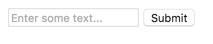
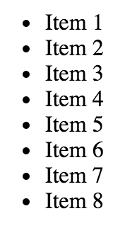
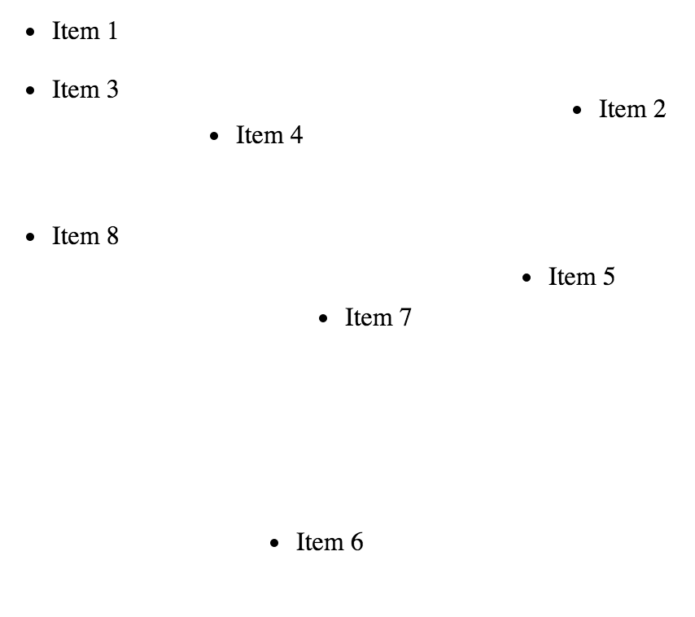

# Frontend Intermediate Textbook
## Lesson Nine

### jQuery, forms, and the [`.submit()`](https://api.jquery.com/submit/) method
```html
<form>
  <input type="text" placeholder="Enter some text...">
  <input type="submit" value="Submit">
</form>
```



Look at the code above. `<form>`s have a `submit` event that goes off when you click a `<input type="submit" value="Submit">` button. This tells the browser to send all the information from the form to some backend server somewhere, and refresh the page with what comes back.

Try entering some text and pressing submit. The browser will submit that information to the server and refresh the page. Not a lot to work with there.

Well, we don't want to send the information and refresh the page. We want to "prevent the default" event, keep it from sending anything, and gather the information for us to play with. We can do that using jQuery.

```html
<form>
  <input type="text" placeholder="Enter some text...">
  <input type="submit" value="Submit">
</form>

<script src="https://cdnjs.cloudflare.com/ajax/libs/jquery/2.1.4/jquery.js"></script>
<script>
  $(document).ready(function() {
    $('form').submit(function (event) { // target the form, and put a submit event listener on it. We can capture and pass in the event for us to use
        event.preventDefault(); // this tells the browser to "prevent" the "default" "event" from occuring (sending and refreshing)
        console.log( $(this) ); // let's log out our "this" context (our form element) as a jQuery object
      });
  })
</script>
```

Now, when we submit the form, the page doesn't do anything and we get a jQuery object in our console. Score.

Now within our `$(this)` object, we want to [`.find`](https://api.jquery.com/find/) the `input[type="text"]` element, and get its [`.val`](https://api.jquery.com/val/)ue:
```javascript
var value = $(this).find('input[type="text"]').val();
```
Boom! Now we have the input we need. Let's keep track of our inputs and `.append` some `div` elements to display them under the form

```javascript
$('body').append('<div>' + value + '</div>');
```

The `.val` method also let's us set the value of an element by passing in a string. We can clear the value by passing in an
```javascript
$(this).find('input[type="text"]').val('')
```

### Interacting with the DOM with [jQuery UI](http://jqueryui.com/)
jQuery UI is a library built on top of jQuery. It adds cool frontend [user interactions](http://jqueryui.com/demos/) to your projects. Let's play with one.

Let's start with some base html.

```html
<ul>
  <li>Item 1</li>
  <li>Item 2</li>
  <li>Item 3</li>
  <li>Item 4</li>
  <li>Item 5</li>
  <li>Item 6</li>
  <li>Item 7</li>
  <li>Item 8</li>
</ul>

<script src="https://cdnjs.cloudflare.com/ajax/libs/jquery/2.1.4/jquery.js"></script>
<script src="https://cdnjs.cloudflare.com/ajax/libs/jqueryui/1.11.4/jquery-ui.min.js"></script>
```



Now let's drag them around!

```html
<script>
$('li').draggable();
</script>
```


Cool! Now go build something.
