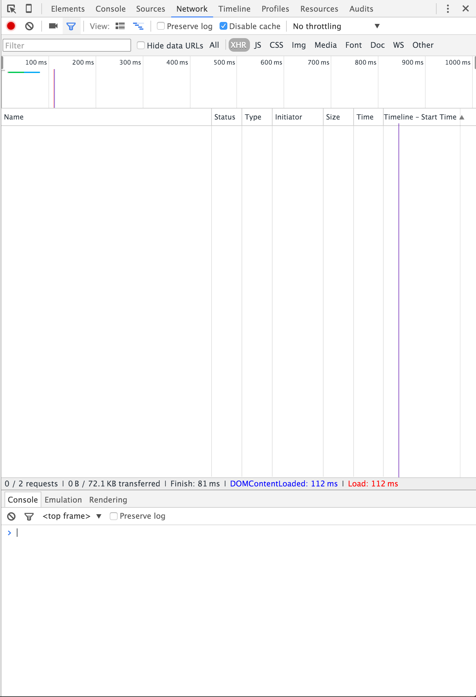
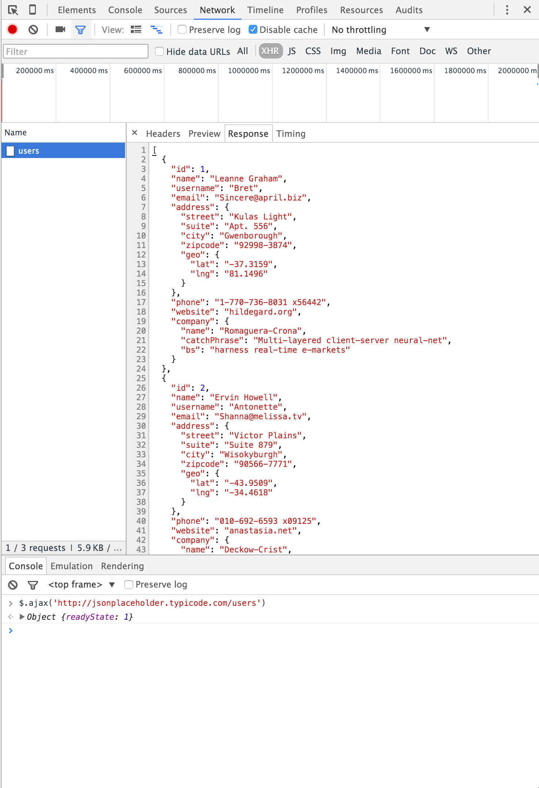
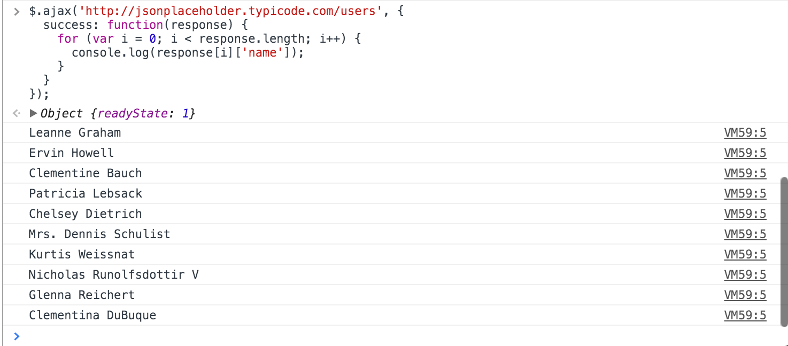

# Lesson Ten

## The API

An application programming interface (API) is a way to talk to a backend application. If you say the magic words, give the correct parameters, and have the proper access, you can control an application and get results from it. Let's see what a sample JSON response looks like. In your browser, enter `http://jsonplaceholder.typicode.com/users/1`. You'll see something return that looks like this.

```JSON
{
  "id": 1,
  "name": "Leanne Graham",
  "username": "Bret",
  "email": "Sincere@april.biz",
  "address": {
    "street": "Kulas Light",
    "suite": "Apt. 556",
    "city": "Gwenborough",
    "zipcode": "92998-3874",
    "geo": {
      "lat": "-37.3159",
      "lng": "81.1496"
    }
  },
  "phone": "1-770-736-8031 x56442",
  "website": "hildegard.org",
  "company": {
    "name": "Romaguera-Crona",
    "catchPhrase": "Multi-layered client-server neural-net",
    "bs": "harness real-time e-markets"
  }
}
```

This is a response. You can change the number on the end to get a different user, or even remove the number altogether to see a list of all the available users. This is a great example of a [RESTful](https://en.wikipedia.org/wiki/Representational_state_transfer#Example) backend.

## AJAX requests

In our last lesson, we learned that submitting a form makes a call, or a request, to the backend and refreshes the page when it returns. We also learned that we can prevent that from happenening with jQuery by capturing the `event` and calling `.preventDefault()` on it.

But what if we want to talk to the server, we just don't want to have to refresh the page when we get our response back? Welcome to the world of AJAX. AJAX allows us to make "silent" calls to a server and accept the request without having to refresh the page. We can even paly with the data that is returned! Let's see it in action.

Let's load jQuery in a `ajax.html` file

```html
<!DOCTYPE html>
<html>
<head>
</head>
<body>
  <script type="text/javascript" src="https://cdnjs.cloudflare.com/ajax/libs/jquery/2.1.4/jquery.min.js"></script>
</body>
</html>
```

and open it in a browser.

Now in your browser, open your Developer Tools, go to your network tab, and expand your console underneath.



Now in your console, we can send an AJAX request.
```javascript
$.ajax('http://jsonplaceholder.typicode.com/users')
```


We can now view the response in the individual request information. Great! Now, given that we have a `success`ful request, let's see we can capture the JSON object.

```javascript
$.ajax('http://jsonplaceholder.typicode.com/users', {
  success: function(response) {
    for (var i = 0; i < response.length; i++) {
      console.log(response[i]['name']);
    }
  }
});
```



Score!

## [Underscore.js](http://underscorejs.org/)

Uugghh!! I'm so tired of righting `for` loops. They are ugly, don't give much context to what is happening, and take too long to write.

Well, we're not alone! The Underscore.js library is considered a Swiss army knife for JavaScript. It has a million useful functions for use to use at our disposal. Let's take a look at probably the most used function, `_.each`. This handy little function builds for loops for us. if we had a collection of objects in an array (much like our JSON response from before), we can iterate through them like a breeze:
```javascript
var people = [
  {
    name: Kevin,
    age: 29
  },
  {
    name: Eden,
    age: 9
  },
  {
    name: Eve,
    age: 3
  }
];

_.each(people, function (person) { // I get to choose the "item" name! (I chose "person" becuase that is what each item in my collection represents, this is conventional)
  console.log(person.name + ' is ' + person.age + ' years old!');
});

//=> 'Kevin is 29 years old!
//=> 'Eden is 9 years old!
//=> 'Eve is 3 years old!
```

Let's write our above AJAX example using underscore. First we have to include it in our `ajax.html` file.

```html
<!DOCTYPE html>
<html>
<head>
</head>
<body>
  <script type="text/javascript" src="https://cdnjs.cloudflare.com/ajax/libs/jquery/2.1.4/jquery.min.js"></script>
  <script type="text/javascript" src="https://cdnjs.cloudflare.com/ajax/libs/underscore.js/1.8.3/underscore-min.js"></script>
</body>
</html>
```

Now load it up in the browser, head to your network panel with the console expanded.

```javascript
$.ajax('http://jsonplaceholder.typicode.com/users', {
  success: function(response) {
    _.each(response, function(user) {
      console.log(user.name);
    });
  }
});
```

That's much nicer. Take a look at the [Underscore.js](http://underscorejs.org/) docs to see what all it gives you. It's an extremely popular library and it's very beneficial to have in your toolbox when developing.